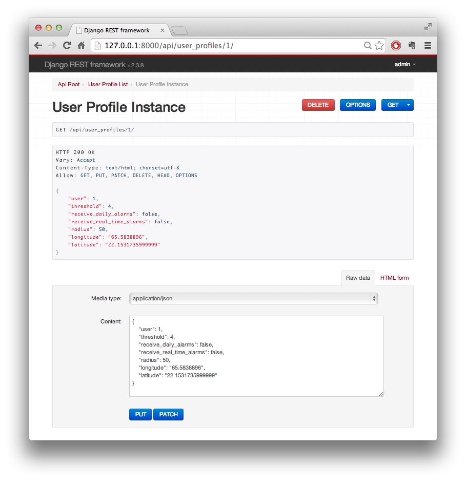

API Documentation
=================

AuroraAlarm application has a RESTful API, built with Django REST Framework, a powerful and flexible toolkit that makes it
easy to build web APIs. Here are some reasons, why we have decided to use this framework:

* The web browseable API is a huge usability win for developers.
* Extensive documentation and great community support.
* Highly customizable with regular function-based views.
* Native authentication support for OAuth2.

If you want to extend this API, we recommend to check the official documentation for Django REST Framework, which can be
found here::

    http://www.django-rest-framework.org/api-guide/requests

The web browseable API
----------------------
At the moment API is in development mode and can be accessible without root permission. This a big security issue and
has to be fixed. This issue has been added to the roadmap. But on the other hand, you can try and change values and you
can interact with the website through API. You can find it here::

    http://aurora-alarm.herokuapp.com/api/

The web interface is very simple. You can navigate between different object via links or through URLs. Through URLs you
 can also use filtering options (check the official documentation). This interface
enables you to execute all CRUD (create, read, update, delete) operations. If you make requests through browser, you will
get HTTP response, otherwise you will get a classical JSON response. You can also switch between HTTP and JSON through
the interface, a button for switching is at top-right corner.

API resources
-------------

Aurora daily forecast
^^^^^^^^^^^^^^^^^^^^^
Here are saved all aurora activity levels. These values are added automatically with parsing script.

**Methods**

* GET /api/aurora_daily_forecast/:id
* POST /api/aurora_daily_forecast/
* PUT /api/aurora_daily_forecast/:id
* DELETE /api/aurora_daily_forecast/:id

**Attributes**

* id [integer] - unique identification number
* date [date] - for which day is value
* first_value [integer] - value entered first time (not updated)
* current_value [integer] - the latest entered value
* created [date] - date when was created
* modified [date] - date when was modified

**Example of object**::

    {
        "date": "2014-01-01",
        "first_value": 5,
        "current_value": 5,
        "created": "2014-01-10T16:18:29.211Z",
        "modified": "2014-01-10T16:18:29.211Z",
        "url": "http://aurora-alarm.herokuapp.com/api/aurora_daily_forecast/1/",
        "id": 1
    }

Users
^^^^^
Collection of all authenticated users. User is added through OAuth2 authentication protocol.

**Methods**

* GET /api/users/:id

**Attributes**

* id [id]
* username [string]
* email [string]
* groups [group]
* userprofile [integer]

**Example of object**::

    {
        "id": 1,
        "username": "admin",
        "email": "zupec.nejc@gmail.com",
        "groups": [],
        "userprofile": 1
    }

User profiles
^^^^^^^^^^^^^
Here are saved settings for each user.

**Methods**

* GET /api/user_profiles/:id
* POST /api/user_profiles/

**Attributes**

* id [integer]
* user [integer]
* threshold [integer]
* receive_daily_alarms [boolean]
* receive_real_time_alarms [boolean]
* radius [integer]
* longitude [decimal number]
* latitude [decimal number]

**Example of object**::

    {
        "user": 1,
        "threshold": 4,
        "receive_daily_alarms": true,
        "receive_real_time_alarms": true,
        "radius": 50,
        "longitude": "22.26990333632807000",
        "latitude": "65.59864468311174000"
    }

Photos with location
^^^^^^^^^^^^^^^^^^^^
API for photos with location. These photos are shown in gallery and map.

**Methods**

* GET /api/photo_with_location/:id
* POST /api/photo_with_location/
* PUT /api/photo_with_location/:id
* DELETE /api/photo_with_location/:id

**Attributes**

* id [integer]
* image [string]
* date_taken [date]
* view_count [integer]
* crop_from [string]
* effect [string]
* longitude [decimal number]
* latitude [decimal number]

**Example of object**::

    {
        "id": 1,
        "image": "photologue/photos/aurora1_1.png",
        "date_taken": "2014-01-07T08:52:36.501Z",
        "view_count": 34,
        "crop_from": "",
        "effect": null,
        "longitude": "22.12708107070307000",
        "latitude": "65.61169027833819000"
    }
