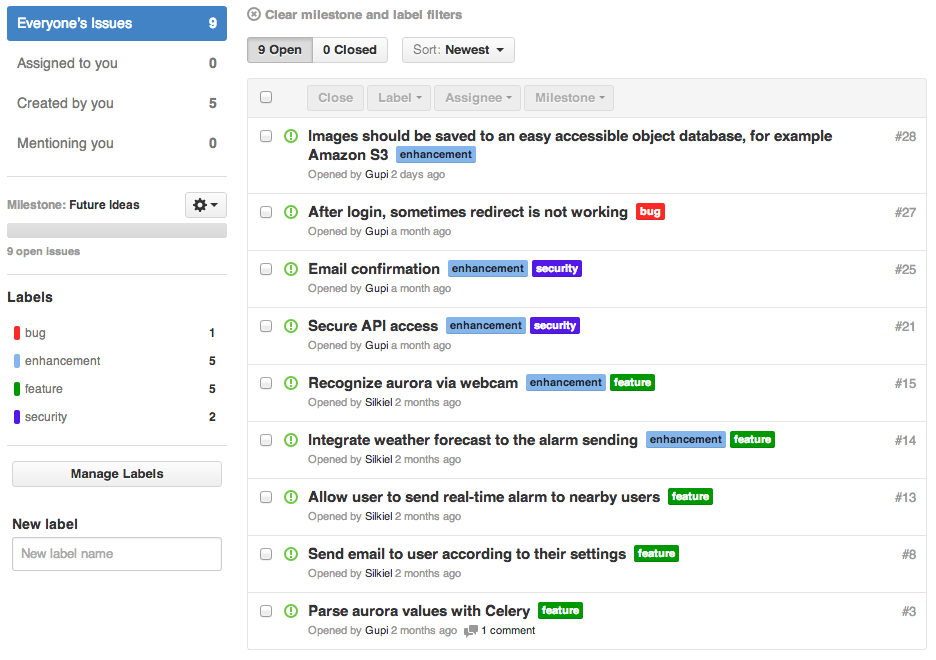

Future work
===========
In this chapter we would like to present our ideas, how this project can be extended and upgraded. Some ideas are quite
easy to realize and some of them can take a lot of time to implement, e.g. aurora recognition with an USB camera or
integrating weather forecast. All ideas and tasks are collected in our issue system at Github repository.

